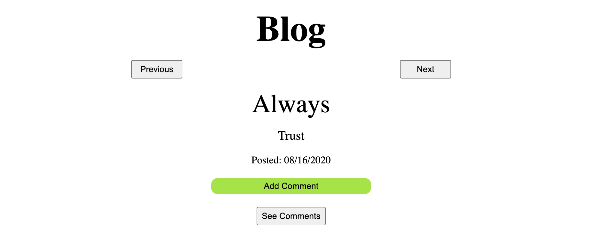

# Guest Blog Site

Deployed: https://phoenix-99hp.github.io/blog-posts/

This is the front-end guest site for my blog that I made using React. Fetch requests are made to my back-end Node/Express API that exists on Heroku which retrieves posts and comments from my database on MongoDB Atlas. Users can view my blog posts and click the next and previous buttons to access additional posts. Additionally, users can leave comments on specific posts. 

The idea for this project came from the Odin Project's Full-Stack Javascript Curriculum (https://www.theodinproject.com).

